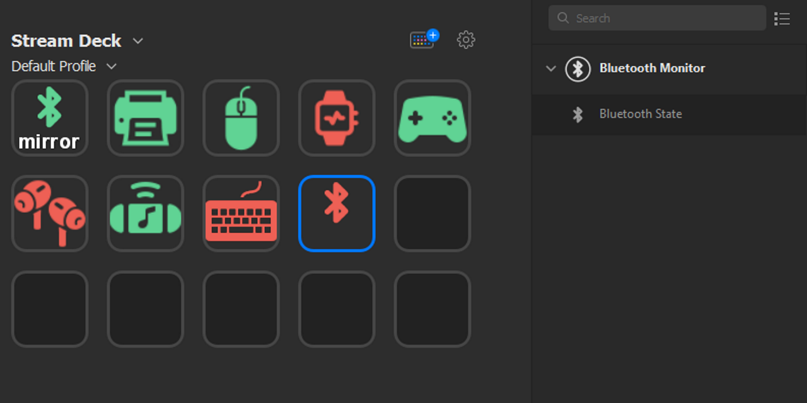
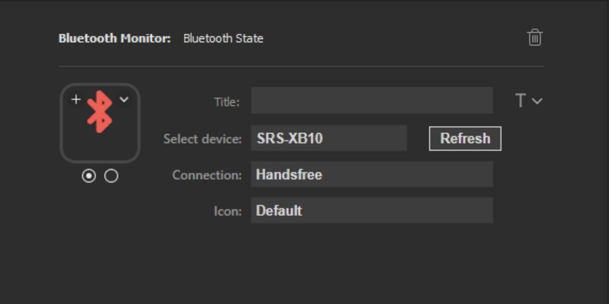

# StreamDeck Bluetooth Plugin

This repository contains a Bluetooth Manager plugin for the Elgato StreamDeck
## Table of Contents

- [Description](#description)
- [Features](#features)
- [Requirements](#requirements)
- [Installation](#installation)
- [Usage](#usage)
- [Limitations](#limitations)
- [Troubleshooting](#troubleshooting)
- [Contributing](#contributing)
- [License](#license)
- [Acknowledgements](#acknowledgements)

## Description

The Bluetooth Device Manager Plugin for Elgato StreamDeck simplifies the management of your Bluetooth devices. It allows you to monitor their connection status and connect them with a single button press.

## Features

- Show a colour-coded status indicator for the device, red for connected, green for disconnected
- Users can change the icons, either  by using one of the built-in icon options or by using their own custom icons
- Where the device advertises connection options, users will be able to tell Windows to connect to the device by pushing the StreamDeck's key

## Requirements

- Elgato StreamDeck hardware, StreamDeck+ dials/touchscreen are not explicitly supported but may work.
- Elgato StreamDeck software (v5.0 or higher)
- Operating System: Windows 10 or later only

## Installation
### Manual

1. Download the latest release from the [releases page](https://github.com/yourusername/elgato-streamdeck-plugin/releases).
2. Locate the downloaded `.streamDeckPlugin` file and double-click it to install the plugin.
3. The StreamDeck software should open, and you should see a prompt to confirm the installation. Click "Install" to continue.

### From Elgato Plugin store

&emsp;[https://apps.elgato.com/plugins/me.rumkee.bluetooth.monitor](https://apps.elgato.com/plugins/me.rumkee.bluetooth.monitor)

## Usage

1. Drag and Drop the Bluetooth Status Action from the Bluetooth Monitor Action List category onto an empty Key
2. The Select device option will take a moment to scan all paired Bluetooth devices, or if already populated, use 
the refresh button to rescan new devices.
3. Select the desired device from the devices list
4. The Connection options will take a moment to populate, select the desired connection option - you may need to try several of the options until you find the one that works for your intentions.
5. If 'None' is the only option, then the device does not advertise any RfComm Services, So you will not be able to connect from the stream deck
6. Select an Icon other than the Default one if you wish to. Alternatively, you can use your own custom icons by clicking the Icon image and choosing files for each of the radio button states (Disconnected & Connected)

## Limitations
This section outlines the current limitations and known issues associated with the Bluetooth Device Manager Plugin. 
I am only one individual with a limited number of Bluetooth devices to test with, so don't be too surprised if you find a device that doesn't work. If you do, please report it on the GitHub issues page.

1. At the present time, there is no support for Bluetooth LE devices
2. I've done limited testing on device types other than audio devices.
3. This will only work for already paired devices.
4. I'd like to add disconnect functionality - if I can figure out how to do it!

If you encounter any issues, please report them on my [GitHub issues page](https://github.com/yourusername/elgato-streamdeck-bluetooth-plugin/issues), so we can work on resolving them as soon as possible.

## Troubleshooting

- I can't see my device!

	- Check the device has been paired to windows.
	- Press the 'refresh' button to reload devices.
	- Verify you can see the device listed under 'Bluetooth and other Devices' in Windows settings
	- Verify the device supports Bluetooth and isn't a Bluetooth LE device ( LE devices are not supported yet)

- When I press to connect, it briefly connects, then disconnects!

	- This behaviour is often seen when a device is connected to something other than Windows.
	In this case, the plugin can not know that the device is connected to something else. Windows will incorrectly briefly report connecting, even though it hasn't.

- I see a warning triangle when I press the button!

	- This will happen if you have failed to select a 'connection' option in the settings

- Why is the button icon grey?

	- A grey icon indicates that Bluetooth is disabled. The icon will also be greyed out temporarily whilst establishing a connection

## Contributing

I absolutely welcome PR's to this project!

## License

This project is licensed under the MIT License - see the [LICENSE.md](./LICENSE.md) file for details.

## Acknowledgements
1. [Elgato SDK](https://developer.elgato.com/documentation/stream-deck/sdk/overview/)
2. [FritzAndFriends/StreamDeckToolkit](https://github.com/FritzAndFriends/StreamDeckToolkit) This plugin is built on top of the StreamDeckToolkit, which is a wrapper around the Elgato SDK.
3. [Collors.co](https://coolors.co/palette/ee6055-60d394-aaf683-ffd97d-ff9b85) colour palette used for the StreamDeck plugin icon
4. [icons8](https://icons8.com) the icons used in this plugin
